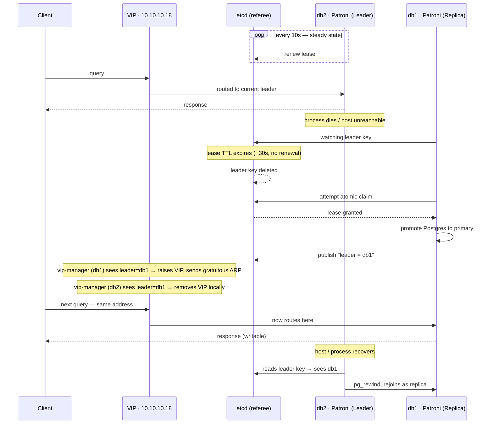

# Amfileon PostgreSQL High-Availability Cluster

**Infrastructure reference — prepared 2026-07-21**

Status: 3/3 nodes healthy · quorum 2-of-3 tolerant · mTLS enforced · failover verified (~30s) · backups not yet configured

---

## Why this exists

Every ETL job, dashboard, and downstream process that touches this Postgres instance depends on one
machine staying up. If that machine's disk fails, its kernel panics, or someone reboots it at the
wrong moment, every one of those consumers goes down with it — and someone has to notice, log in, and
manually bring a replacement online.

This cluster removes the human from that path. A second database continuously mirrors the first. An
independent group of three referees continuously agrees on which of the two is authoritative. And a
small agent on each host makes sure that whichever one is authoritative is also the one client traffic
actually reaches — automatically, in the time it takes to notice a heartbeat has stopped.

---

## Topology — three hosts, three distinct jobs

db1 and db2 run the database. All three hosts vote on who's in charge. Only one host at a time is
ever writable.

```
                         ┌────────────────────────────────────┐
                         │  Applications · ETL jobs · Dashboards │
                         │      (connect to one address, always)│
                         └──────────────────┬───────────────────┘
                                            │
                              ┌─────────────▼─────────────┐
                              │       10.10.10.18          │
                              │  virtual IP · postgres.amf │
                              └──────────────┬─────────────┘
                                             │
              (moves here if db2 fails)      │ (currently sits here)
        ┌────────────────────────────────────┼────────────────────┐
        │                                    ▼                    │
┌───────▼────────────────┐         ┌─────────────────────────┐    │
│ db1 · 10.10.10.20        │  WAL   │ db2 · 10.10.10.21        │    │
│ iface: ens259f0          │◄───────│ iface: ens259f0np0       │    │
│ ─────────────────────── │        │ ─────────────────────── │    │
│ etcd1        · voter     │        │ etcd2        · voter     │    │
│ Patroni+PG17 · replica   │        │ Patroni+PG17 · LEADER    │    │
│ vip-manager  · standing  │        │ vip-manager  · holds VIP │    │
└───────────┬──────────────┘        └────────────┬─────────────┘   │
            │                                    │                 │
            │        Raft consensus (amfcluster)  │                 │
            └───────────────────┬────────────────┘                 │
                                 │            quorum: 2 of 3         │
                     ┌───────────▼────────────┐                     │
                     │ prod3 · 10.10.10.13      │◄────────────────────┘
                     │ ─────────────────────── │
                     │ etcd3 · voter only        │
                     │ no Postgres, no VIP       │
                     │ — pure tiebreaker         │
                     └──────────────────────────┘
```

Every connection above is authenticated with a certificate signed by a dedicated cluster CA — not a
shared internet identity. Postgres and etcd never share a port: **15432** for data, **12379/12380**
for consensus, **18008** for health checks.

> The diagram shows the cluster's current state — db2 leading, db1 following. That is a fact about
> *now*, not a fixed assignment: either machine can hold either role, and the whole point of the design
> below is that the role moves without anyone choosing it.

---

## Design — three independent layers, one job each

Nothing in this design does two jobs. That separation is what makes the failure modes predictable:
the referee only ever answers "who is in charge," the database only ever moves data, and the routing
layer only ever obeys the referee.

### Layer 1 — The referee: etcd (distributed consensus)

Three independent processes, one per host, that continuously agree on a single fact: which database
currently holds the "I am in charge" lease. No client ever reads or writes trading data through this
layer — it exists purely to arbitrate leadership.

| | |
|---|---|
| Software | etcd 3.5.21 |
| Members | 3 (db1, db2, prod3) |
| Quorum | 2 of 3 |
| Ports | 12379 / 12380 |
| Trust | dedicated cluster CA |

### Layer 2 — The data: Patroni + PostgreSQL

Each database node is managed by Patroni, which watches the local Postgres, holds the etcd lease when
healthy, and streams every committed byte to the standby continuously. If it can't confirm the lease,
it takes its own database read-only — on purpose.

| | |
|---|---|
| Database | PostgreSQL 17.2 |
| Manager | Patroni 4.x (Spilo) |
| Replication | streaming, async |
| Port | 15432 |
| REST | 18008 |

### Layer 3 — The path: vip-manager (routing)

A floating address, `10.10.10.18`, that always sits on whichever node holds the lease. One agent per
database host watches the same lease etcd holds and raises or drops the address accordingly — clients
never learn a failover happened.

| | |
|---|---|
| Tool | vip-manager 4.2.0 |
| VIP | 10.10.10.18 / 24 |
| Mechanism | gratuitous ARP |
| Failure mode | drops VIP, never guesses |

---

## Behaviour — what happens when the primary dies

This is the sequence that was actually run and timed against the real hosts — not a theoretical
description. The diagram shows who does what, in what order; the walkthrough below it fills in the
detail. *(If your viewer doesn't render Mermaid diagrams, the numbered steps underneath cover the
same sequence in plain text.)*



1. **Primary stops responding** *(t+0s)* — The leading node's Patroni stops renewing its etcd lease
   — because the process died, the host is unreachable, or the disk failed. Nothing has to detect this
   explicitly: the absence of a renewal is the signal.

2. **The lease expires** *(t+~30s)* — etcd deletes the leadership key once the lease's time-to-live
   elapses. The standby's Patroni, watching the same key, sees the vacancy and attempts to claim it —
   an atomic operation that only one node can win.

3. **The standby promotes** *(measured: ~24–30s)* — Holding the new lease, Patroni promotes its local
   Postgres from read-only standby to a writable primary. The old primary, if it comes back, sees the
   lease held by someone else and rejoins as a replica — it is never allowed to write again until it
   does.

4. **The address follows** *(sub-second)* — vip-manager on the new leader sees its own name in the
   lease and raises `10.10.10.18` on its network interface, broadcasting the change to the network.
   vip-manager on the old leader sees it no longer holds the lease and removes the address on its side
   — independently, with no coordination between the two.

5. **Clients reconnect — unaware** *(on next connection attempt)* — Every application still points at
   `10.10.10.18`. The network now routes that address to the new primary. No connection string
   changes, no DNS change, no operator action.

The drill that produced the timings above:

```bash
docker compose stop pg2                      # kill the leader
...
patronictl list
+--------+-------------------+---------+-----------+----+
| db1    | 10.10.10.20:15432 | Leader  | running   |  5 |
| db2    | 10.10.10.21:15432 | Replica | streaming |  5 |
+--------+-------------------+---------+-----------+----+
ip addr show ens259f0 | grep 10.10.10.18
    inet 10.10.10.18/24 scope global secondary ens259f0
```

---

## Security — nothing talks without a certificate

Every connection in the topology above — database-to-referee, referee-to-referee, routing
agent-to-referee — is mutual TLS. A dedicated certificate authority was created solely for this
cluster: it is trusted by nothing else at the firm, so a problem here cannot spread, and a problem
elsewhere cannot reach in. Without a valid certificate, a connection is refused before a single byte
of leadership data is exchanged.

| Host | Identity | Role | Usage |
|---|---|---|---|
| db1 | etcd1 | server · peer · client | Consensus voter |
| db2 | etcd2 | server · peer · client | Consensus voter |
| prod3 | etcd3 | server · peer · client | Consensus voter (tiebreaker) |

Each host's server certificate carries both server and client authentication rights — a deliberate
choice, since etcd's own internal request-forwarding path re-presents the server certificate in a
client role, and a certificate missing that second right will fail a specific internal handshake that
would otherwise look like a network fault.

---

## Verification — what has actually been proven

Every row below was demonstrated on the real hosts listed in this document, not in a simulation.

| Test | Result | Status |
|---|---|---|
| Streaming replication, primary → standby | lag 0 MB, timeline in sync | ✅ verified |
| Standby rejects writes while following | `"cannot execute in a read-only transaction"` | ✅ verified |
| Automatic failover on primary loss | promoted in ~24–30s | ✅ verified |
| Virtual IP follows the new primary | moved across physical NICs, real switches | ✅ verified |
| Old primary fenced on rejoin | rejoins as replica, never dual-writes | ✅ verified |
| Quorum survives one voter down | 2 of 3 healthy → cluster fully operational | ✅ verified |
| All inter-node traffic requires a valid client certificate | unauthenticated connections refused | ✅ verified |

---

## Remaining work — what this cluster does not yet do

1. **Backups do not exist.** A standby is a mirror, not an archive — it faithfully replicates a
   mistaken `DROP TABLE` as reliably as it replicates a valid write. Continuous backup with
   point-in-time recovery is the highest-priority item before real data lands here.

2. **No client points at the cluster yet.** The internal name `postgres.amf` is not yet mapped to
   `10.10.10.18`, and no application has been migrated. This is a deliberate, reversible step to take
   once backups exist.

3. **Data-loss tolerance is undecided.** Replication is currently asynchronous, which means a small
   window of the most recent commits could be lost in an unplanned failover. Synchronous replication
   removes that risk at the cost of write latency — the right setting depends on what this cluster
   ends up holding.

4. **Monitoring is not yet connected.** Existing Prometheus/Grafana infrastructure needs to be pointed
   at this cluster's metrics, with alerting on replication lag, quorum loss, and the specific failure
   mode where an unused replication slot silently fills a disk.

---

## Reference — terms used in this document

- **Quorum** — A strict majority of voters. With 3 members, any 2 agreeing is enough to act — and any
  single voter's opinion, alone, is never enough.
- **DCS** — Distributed Configuration Store — the general term for what etcd is here: a small,
  separately-replicated store used to decide facts the rest of the system must agree on.
- **Lease** — A claim to leadership that expires automatically unless renewed. The primary must keep
  proving it's alive; silence is treated as absence.
- **Virtual IP (VIP)** — An address that is not permanently tied to one machine's network card, and can
  be moved to another machine on demand.
- **Gratuitous ARP** — An unprompted broadcast announcing "this address now lives at this hardware
  address," used to make a VIP move take effect across the network in under a second.
- **mTLS** — Mutual TLS — both sides of a connection present a certificate and verify the other's,
  rather than only the server proving its identity.

---

*Amfileon · Postgres HA cluster · internal infrastructure reference · cluster `amfcluster` · db1 / db2 / prod3*
